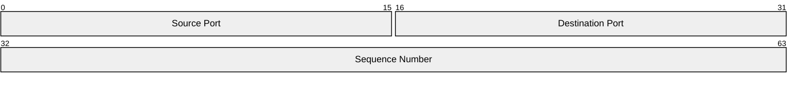

> **Warning**
>
> ## THIS IS AN AUTOGENERATED FILE. DO NOT EDIT.
>
> ## Please edit the corresponding file in [/packages/mermaid/src/docs/syntax/tubemap.md](../../packages/mermaid/src/docs/syntax/tubemap.md).

# Tube Map Diagram (v11.0.0+)

## Introduction

A Tube Map diagram is a representation of

## Usage

This diagram type is particularly useful for developers, enthusiasts, educators, and students who want a visualisation for collections of linear elements or processes that may intersect, overlap, or partially coincide.

## Syntax

```md
tubemap-beta
TODO
... More Fields ...
```

## Examples

```mermaid-example
---
title: "example"
---
tubemap-beta
TODO
```

```mermaid
---
title: "example"
---
tubemap-beta
TODO
```

```mermaid-example
tubemap-beta
title "another example"
TODO
```

```mermaid
tubemap-beta
title "another example"
TODO
```

## Details of Syntax

- **Ranges**: TODO
- **Field Description**: TODO

## Configuration

Please refer to the [configuration](/config/schema-docs/config-defs-tubemap-diagram-config.html) guide for details.

<!--

Theme variables are not currently working due to a mermaid bug. The passed values are not being propagated into styles function.

## Theme Variables

| Property         | Description                | Default Value |
| ---------------- | -------------------------- | ------------- |
| byteFontSize     | Font size of the bytes     | '10px'        |
| startByteColor   | Color of the starting byte | 'black'       |
| endByteColor     | Color of the ending byte   | 'black'       |
| labelColor       | Color of the labels        | 'black'       |
| labelFontSize    | Font size of the labels    | '12px'        |
| titleColor       | Color of the title         | 'black'       |
| titleFontSize    | Font size of the title     | '14px'        |
| blockStrokeColor | Color of the block stroke  | 'black'       |
| blockStrokeWidth | Width of the block stroke  | '1'           |
| blockFillColor   | Fill color of the block    | '#efefef'     |

## Example on config and theme



-->
